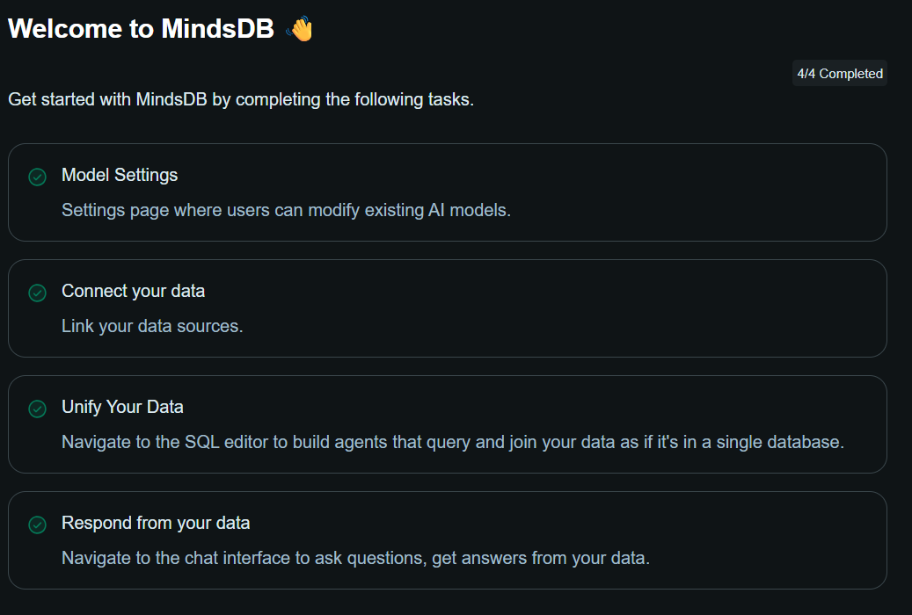

# Working With MindsDB Using Java

## What is MindsDB?
- MindsDB is a tool that helps you to add AI and machine learning capabilities to your existing databases without any complicated setup.
- It Lets You Ask Questions in normal language or SQL and get answers by Running smart AI models behind the scenes.
- Your can train and use machine learning models right where your data lives, without moving or copying it.
- MindsDB makes AI accessible for people who know SQL but aren't experts in Machine Learning.
- It works many databases (like MySQL, PostgreSQL, MongoDB, and more) and data sources (like CSV files, etc.), making it easy to add AI predictions and automation.
- In short, **MindsDB is like a smart assistant for your databases**, helping you get AI-powered insights using familiar languages like SQL or plain English.

## Steps for Self-Hosting MindsDB using Python commands
1. **Create a Virtual Environment**
   * **Why To Do This?**
     * **Dependency Isolation:** - By Creating Virtual Environments, you will be able to maintain set of dependencies for one project, which will be separate from all other projects or code Python installation, which will avoid the conflicts between package or dependency version required for different projects. For Example:- for **ProjectA** you require **Python Version 3.13** and for **ProjectB** you require **Python Version 3.10** and if we install both python versions in core python and use it from there, then this will create a conflict for both projects every time, like which Python version should be used. So to avoid this, we will be creating 2 separate Virtual Environments for both projects, so that we can use different Python versions.
     * **Reproducibility:** - By Encapsulating dependencies for a project, we can ensure tat this project will work the same way on other systems or when shared with others. This is crucial for collaboration and deployment, so that to avoid any conflicts.
     * **Cleanliness:** - Installing packages or dependencies system-wide can clutter your environment or may cause conflicts in different projects. By using Virtual Environments, we can maintain the cleanliness by installing separate dependencies for all different projects.
     * **Self Experimentation:** - We can safely install, update or remove packages in Virtual Environments, without affecting other projects pr core Python installation, enabling experimentation with package versions or configurations without risk.

   * **Commands to create Virtual Environments**
     ```bash 
     python -m venv mindsDB-env
     ```
     * This command creates a new virtual environment named `mindsDB-env` and by default, `mindsDB-env` will be having the latest python which is installed on your system.<br><br>
     
     ```bash
     python -3.10 -m venv mindsDB-env
     ```
     * This command creates a new virtual environment named `mindsDB-env` and since we are specifying `-3.10`, `mindsDB-env` will be having Python version 3.10, even if you have the latest Python version installed on your System.<br><br>
2. **Activate the Virtual Environment that you created**
   * So now, to work with `mindsDB-env`, you need to activate it first.
   * **Command to Activate the Virtual Environment**<br><br>
     ```bash
     .\mindsDB-env\Scripts\activate
     ```
   * After activating the virtual environment, your terminal prompt will prefix with the virtual environment name like `(mindsDB-env) PS C:\Users\user_name>` and now you can start working in the virtual environment.<br><br>
3. **Install MindsDB**
   * Now You need to install MindsDB through pip, which is a package manager for Python.
   * **Command to Install MindsDB**<br><br>
     ```bash
     pip install mindsdb==<specific_version>
     ```
     (like 25.7.4.0 which is the latest version)<br><br>
4. **Host MindsDB**
   * After installing MindsDB, you can start the MindsDB server.
   * **Command to Host MindsDB**<br><br>
     ```bash
     python -m mindsdb
     ```
   * After running the above command, MindsDB server will start at **http://127.0.0.1:47334** end-point.<br><br>
5. **Deactivate the Virtual Environment**
   * After completing your work with MindsDB, you can deactivate the virtual environment.
   * **Command to Deactivate the Virtual Environment**<br><br>
     ```bash
     deactivate
     ```

## MindsDB Operations
* After Hosting the MindsDB using python for first time, you will reach `onboarding page` or `Welcome page` of MindsDB, where you have to complete some operations like <br><br>
   <br>where the important step is to register a Default Model, which will be later used to create a Model for your data.<br><br>
   <br>and you will be getting 4 providers by default, which are `Azure OpenAI`, `OpenAI (gpt-4.1)`, `Google (gemini-2.5-flash)` and `Custom OpenAI API` and you have to get the api key for creating a model for any provider selected by you.


* After completing the onboarding process, you will be redirected to the MindsDB Sql Editor, where you can start performing operations related to MindsDB. And the Sql Edit Looks Like<br><br>
  


* Click the `+` button to get a new editor tab, where you can write your SQL queries or MindsDB queries to perform various operations like,
  1. **Create and Connect to Database** - you need to create a database and connect to it, so that you can perform operations on it.
     * **Command to Create a Database**<br><br>
       ```sql
       CREATE DATABASE gms_ai
       WITH ENGINE = 'mysql',
       PARAMETERS = {
          "host": "localhost", 
          "port": 3306,
          "database": "gms_ai",
          "user": "your_local_mysql_username",
          "password": "your_local_mysql_password"
       };
       ```
       here `gms_ai` is the name of the database and iam using `mysql engine` of **MindsDB** to connect and perform operations on it. And under PARAMETERS, you need to provide host, port, database name, local MySQL username and Local MySQL password to connect to the database.<br><br>
  2. **Check for Tables in the Database Created** - After creating and connecting to the database, you can check whether the tables that were present in Local mysql databases are present in MindsDB or not.
     * **Command for checking the tables in the Database**<br><br>
       ```sql
       SHOW TABLES FROM gms_ai;
       ```
       This will return list of tables present in gms_ai database.<br><br>
  3. **Create SKILL** - In MindsDB, a SKILL connects an AI agent to a particular database or data source, enabling the agent to execute queries and retrieve relevant data when responding.
     * **Command to Create a SKILL**<br><br>
       ```sql
       CREATE SKILL gym_sql_skill
       USING
           type = 'sql',
           database = 'gms_ai', 
           description = 'Executes SQL queries on gms_ai MySQL DB';
       ```
       Here `gym_sql_skill` is the name of the SKILL and the SKILL is being created using `type='sql'` which generates and executes the SQL queries on `database='gms_ai'` and at the end you have to mention the description of the SKILL, which is optional but recommended to provide a brief about the SKILL.<br><br>
  4. **Create ML_ENGINE** - In MindsDB, an ML_ENGINE is a component that allows you to create and manage machine learning models, enabling AI capabilities within your database.
     * **Command to Create an ML_ENGINE**<br><br>
       ```sql
       CREATE ML_ENGINE gemini_engine
       FROM google_gemini
       USING
           api_key = 'your_default_model_api_key';
       ```
       Here `gemini_engine` is the name of the ML_ENGINE which is using `google_gemini` as the model provider, and you need to provide the `api_key` of the default model that you registered during onboarding process.<br><br>
  5. **Create a MODEL** - In MindsDB, a MODEL is a trained machine learning model that can be used to make predictions or perform tasks based on the data it has learned from.
     * **Command to Create a MODEL**<br><br>
       ```sql
       CREATE MODEL gym_nlq_model
       PREDICT answer
       USING
           engine = 'gemini_engine',
           model_name = 'gemini-2.5-flash',
           prompt_template = '
           You are an expert at converting natural language questions into SQL queries that return table results.
            
           Use these tables in schema gms_ai:
            
           gms_ai.membership:
            - id, duration, name, price, status
            
           gms_ai.trainer:
            - register_no, age, email, gender, name, phno, salary, status, trainer_id, membership_id
            
           gms_ai.member:
            - register_no, age, email, gender, member_id, name, phno, status, membership_id, trainer_rno
            
           Relationships:
            - trainer.membership_id → membership.id
            - member.membership_id → membership.id
            - member.trainer_rno → trainer.register_no
            
           Rules:
            - Use fully qualified table names (e.g., gms_ai.member)
            - Use all columns (SELECT *) unless told otherwise
            - Only generate a single final SQL query
            - Do not use SELECT COUNT(*), DISTINCT, or pre-queries
            - Do not explain anything
            - Just return a final executable SQL query
            - Always filter by status using: UPPER(status) = ACTIVE if the question mentions "active"
            - Always filter by status using: UPPER(status) = INACTIVE if the question mentions "inactive"
            
           Question: {{question}}
            
           SQL:
       ';
       ```
       Here `gym_nlq_model` is the name of the MODEL which is using `gemini_engine` as the ML_ENGINE and `gemini-2.5-flash` as the model_name, and you need to provide the `prompt_template` which will be used to convert natural language questions into SQL queries that return generated SQL query. And you can also provide the rules and relationships between the tables in the database that will help the `gym_nlq_model` to predict the result correctly.<br><br>
  6. **Create a AGENT** - In MindsDB, an AGENT is a component that can interact with users, execute queries, and provide responses based on the data it has access to.
     * **Command to Create an AGENT**<br><br>
       ```sql
       CREATE AGENT gms_ai_agent
       USING
           model = 'gym_nlq_model',
           skills = ['gym_sql_skill'];
       ```
       Here `gms_ai_agent` is the name of the AGENT which is using `gym_nlq_model` as the MODEL and `gym_sql_skill` as the SKILL, which will be used by the AGENT to execute queries and provide responses based on the data it has access to.<br><br>
  7. **Ask a Question to the AGENT** - After creating the AGENT, you can ask questions to the AGENT and it will respond with the generated SQL query or the result of the query.
     * **Command to Ask a Question to the AGENT**<br><br>
       ```sql
       SELECT answer
       FROM gms_ai_agent
       WHERE question = 'Show all active memberships';
       ```
       This will return the correct query to find all the active memberships from the `gms_ai` database to the user as output.<br><br>
* You can use MindsDB Sql Editor to execute the SQL queries which is returned by the AGENT to check the results are correct or not.

## Steps To Integrate MindsDB with Java
1. **Create a Maven Project With Java 17 version**<br><br>
2. **Add Dependencies in pom.xml**
   * Add following dependencies in your `pom.xml` file to use MindsDB with Java.<br><br>
     ```xml
     <dependencies>
        <!-- MySQL Dependency -->
        <dependency>
            <groupId>com.mysql</groupId>
            <artifactId>mysql-connector-j</artifactId>
            <version>8.3.0</version>
        </dependency>

        <!-- Add this to your pom.xml -->
        <dependency>
            <groupId>org.slf4j</groupId>
            <artifactId>slf4j-simple</artifactId>
            <version>2.0.12</version>
        </dependency>
     </dependencies>
     ```
     <br><br>
3. **Create a `config.properties` file**
   * Create a `config.properties` file in the `src/main/resources` directory of your Maven project and add the following properties to it.<br><br>
     ```properties
     # MindsDB Agent Connection
     mindsdb.jdbc.url=your_mindsdb_jdbc_url
     mindsdb.jdbc.user=your_mindsdb_jdbc_username (by default it is mindsdb)
     mindsdb.jdbc.password=your_mindsdb_jdbc_password (by default it is a empty string)
     
     # Real or Local Mysql Connection
     realdb.jdbc.url = your_local_mysql_jdbc_url
     realdb.jdbc.user = your_local_mysql_jdbc_username
     realdb.jdbc.password = your_local_mysql_jdbc_password
     ```
     This file will be used to store the connection details for MindsDB and your local MySQL database. Make sure to replace the placeholders with your actual connection details and `.gitignore` this file to avoid committing sensitive information to your version control system.<br><br>
4. **Create `MindsDBAgentService.java` class**
   * Create a `MindsDBAgentService.java` class under `org.example.gmsnql` package and this file is used handle all MindsDB operations.
   * Through this class, you can connect to MindsDB, execute queries, and get the results from the AGENT.<br><br>
5. **Create `RealDatabaseService.java` class**
   * Create a `RealDatabaseService.java` class under `org.example.gmsnql` package and this file is used to connect to your local MySQL database.
   * This class will be used to execute the SQL query which is returned by the AGENT and get the results from the local MySQL database.<br><br>
6. **Create `TablePrinter.java` class**
   * Create a `TablePrinter.java` class under `org.example.gmsnql` package and this file is used to print the query results in a tabular format.<br><br>
7. **Update `Main.java` class**
   * Update the `Main.java` class contents under `org.example.gmsnql` package to use the `MindsDBAgentService`, `RealDatabaseService` and `TablePrinter` classes to connect to MindsDB, get the results from the AGENT based on the question asked that is the correct SQL query and execute it on the local MySQL database to get the results and print them in a tabular format.
   * The `Main.java` class will be the entry point of your application.
